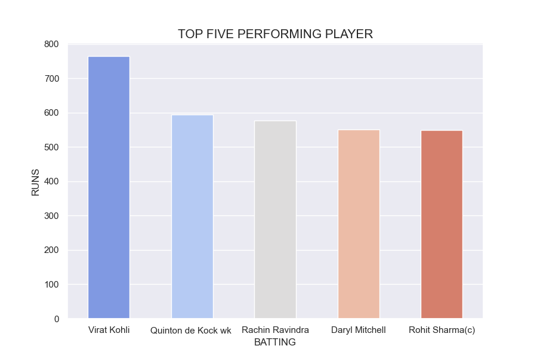
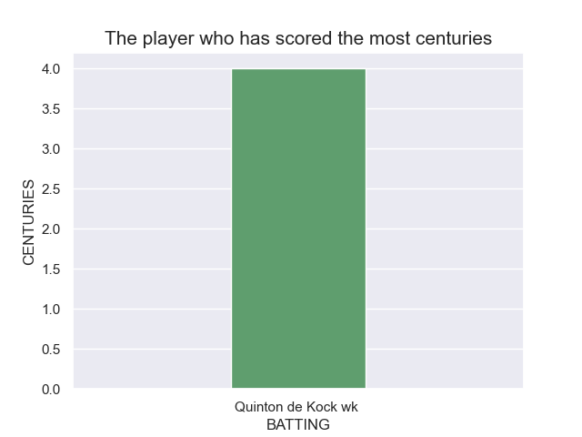
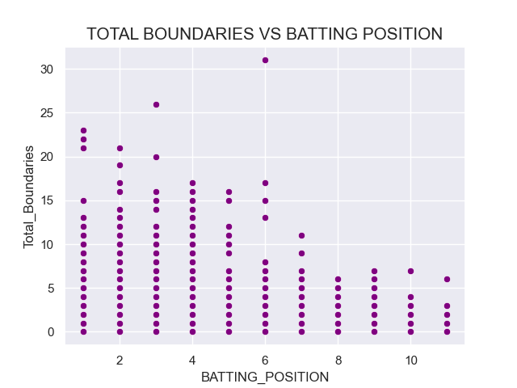
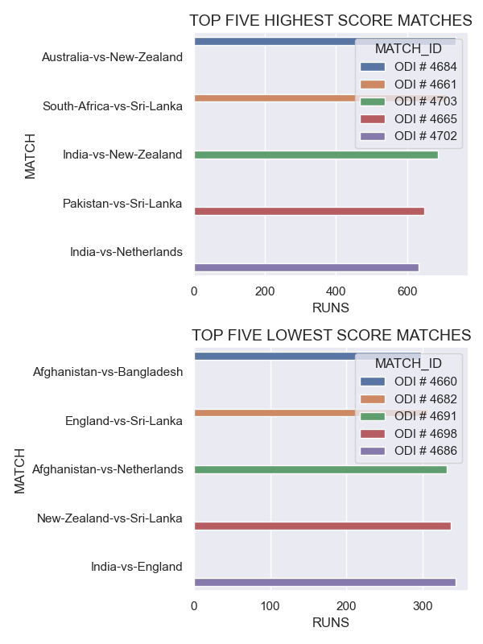

# Analyzing the batsman performance of ICC Men's Cricket World Cup 2023.

## Introduction

* The 2023 ICC Men's Cricket World Cup was the 13th edition of the Cricket World Cup, a quadrennial One Day International (ODI) cricket tournament contested by men's national teams and organized by the International Cricket Council (ICC).India was the host of this tournament , it started on 5 October and concluded on 19 November 2023. Australia was the winner of this tournament.
## Source of Dataset
* We collected the dataset from Kaggle.com
## Size of Dataset
* Size of BATTING dataset is 85.9KB
## About the dataset

* ICC Men's Cricket World Cup 2023 dataset have batting summary of each match separately and a file of each batsmen played in the world cup with some of their information like team, runs,strick rate,match,batting_position etc.
 * Dataset contains 12 columns namely -'BATTING','DISMISSAL','RUNS','BALLS','MINUTES','FOURS','SIXES',STRICK RATE','BATTING_POSITION','MATCH_ID','MATCH','BATTING_TEAM.

## Libraries Used
* pandas
* numpy
* matplotlib
* seaborn

## Exploratory Data Analysis
* Who are the top five performing players based on the total runs scored?

Here we can see top five performing players who are Virat kohili, Quinton de kock, Rachin Ravindra,Daryl Mitchell,Rohit Sharma . Virat kohli is the most performing player and he scored around  770 runs throughout the tournament  .

* who has scored the most centuries?
  

 From the above graph, it is evident that Quinton de Kock has scored the most centuries. He achieving this feat four times.

*  Is there a correlation between the batting position and the number of boundaries hit?
  

 As per my analyze, here the negative correlation suggests that there is a tendency for the total number of boundaries (fours and sixes combined) to decrease as the batting position increases. However, the strength of the correlation is moderate.

 * Can we identify top five high and low score matches ?
  

From the above two graphs, we can conclude that:
 In the first graph, we can see the top five high-scoring matches. Here, the match between Australia and New Zealand with a match ID of ODI # 4684 is the highest high-scoring match(over  In second graph ,we can see top five lowest-scoring matches.Here , the match between Afghanistan and Bangladesh  which match ID ODI # 4660 is the lowest low scoring match(around 300 runs) in the tournament. 
